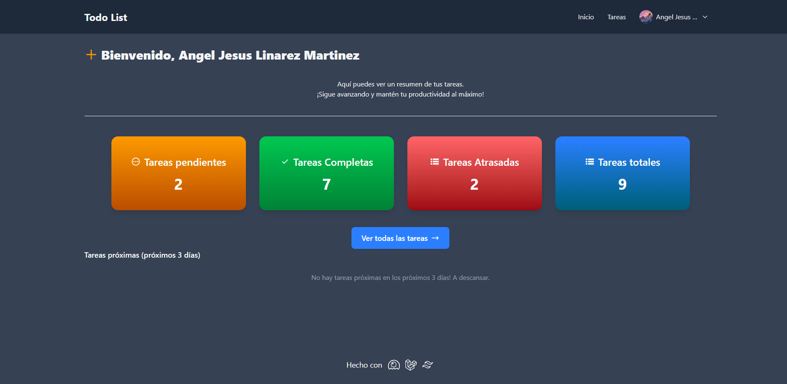

# 📝 Todo List Web App

¡Bienvenido a **Todo List**!  
Esta aplicación web te ayuda a organizar tus tareas diarias de manera sencilla y eficiente.

---

## 🚀 Características

- **Agregar, editar y eliminar tareas**
- **Marcar tareas como completadas**
- **Interfaz intuitiva y responsiva**
- **Persistencia de datos local**

---

## 🌐 ¿Cómo funciona?

1. **Agrega** tus tareas pendientes.
2. **Organiza** tus actividades por prioridad.
3. **Marca** las tareas completadas para llevar un mejor control.
4. **Elimina** tareas cuando ya no las necesites.

---

## 🛠️ Tecnologías utilizadas

- HTML5 & CSS3
- JavaScript
- PHP 
- Laravel(Framework)
- Tailwind CSS 4
- Livewire
- Google OAuth
---

## 📦 Instalación

1. Clona el repositorio:
    ```bash
    git clone https://github.com/tu-usuario/todo-list.git
    ```
2. Ingresa al directorio:
    ```bash
    cd todo-list
    ```
3. Instala las dependencias:
    ```bash
    npm install
    ```
    ```bash
    composer install
    ```
4. Crear la migraciones y la base de datos:
    ```bash
    php artisan migrate
    ```
5. Inserta Valores correctos en el archivo `.env`, en especial: `GOOGLE_CLIENT_ID`, `GOOGLE_CLIENT_SECRET`, `GOOGLE_REDIRECT_URI`, para habilitar el login con Google.
6. Ejecuta el servidor y las vitas:
    ```bash
    composer run dev
    ```
7. Visita la aplicación en `http://localhost:8000`, y ¡listo!
---

## ✨ Capturas de pantalla



---

## 🤝 Contribuciones

¡Las contribuciones son bienvenidas!  
Por favor, abre un _issue_ o haz un _pull request_.

---

## 📄 Licencia

Este proyecto está bajo la licencia [MIT](LICENSE).

---

_Disfruta organizando tu día con Todo List!_